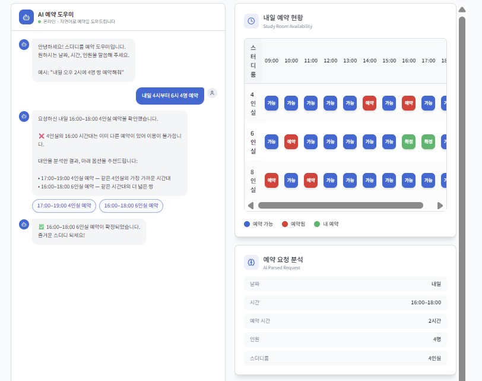
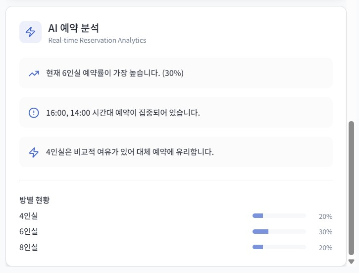
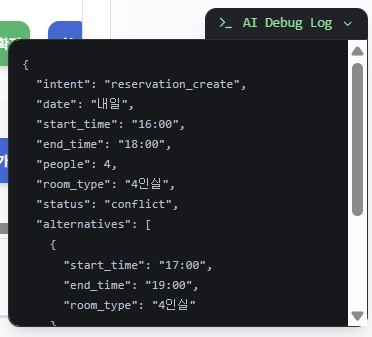

# AI-Powered Study Room Reservation System

자연어 기반 인터페이스를 통해 스터디룸 예약을 처리하고, 예약 충돌 시 AI가 대안을 제시하는 **AI 예약 시스템 프로토타입**입니다.

사용자는 채팅 형태로 자연스럽게 예약을 요청할 수 있으며, 시스템은 이를 구조화된 데이터로 변환하여 예약 가능 여부를 판단하고 대안을 추천합니다.

---

## Demo

> 자연어 예약 → 예약 충돌 감지 → 대안 추천 → 예약 확정 → 예약 조회/취소 → 예약 분석

### 자연어 예약 인터페이스

### 예약 대시보드

### AI Debug Log

---

## 프로젝트 개요

이 프로젝트는 기존 예약 시스템의 **폼 기반 입력 방식** 대신  
**자연어 인터페이스 기반 예약 경험**을 제공하는 것을 목표로 합니다.

사용자는 채팅을 통해 예약을 요청하고, 시스템은 다음 과정을 수행합니다.

- 자연어 요청을 구조화된 예약 데이터(JSON)로 변환
- 예약 가능 여부 확인
- 충돌 발생 시 대안 추천
- 예약 확정 / 조회 / 취소
- 예약 데이터 분석 제공

---

## 주요 기능

### 자연어 기반 예약 요청

사용자는 자연어로 예약 요청을 입력할 수 있습니다.

예시

- 내일 오후 4시부터 6시 4명 예약
- 내일 14-16시 예약
- 내일 6인실 11시부터 15시까지

시스템은 다음 정보를 자동 추출합니다.

- 날짜
- 시작 시간
- 종료 시간
- 인원 수
- 방 타입

---

### 예약 충돌 감지

요청한 시간대에 이미 예약이 존재할 경우 충돌을 감지합니다.

예

❌ 4인실 16:00 시간대는 이미 예약되어 있습니다

---

### 대체 옵션 추천

예약 충돌 시 시스템은 다음 기준으로 대안을 제시합니다.

1. 같은 방의 가장 가까운 다른 시간대  
2. 같은 시간대의 더 큰 방  

예

• 17:00–19:00 4인실 예약  
• 16:00–18:00 6인실 예약

사용자는 버튼 클릭으로 바로 예약을 확정할 수 있습니다.

---

### 시간 범위 예약 지원

단일 시간뿐 아니라 **시간 범위 예약**을 지원합니다.

예

14시부터 16시까지 예약

시스템 처리

14:00–15:00  
15:00–16:00

범위 내 모든 시간대의 예약 가능 여부를 확인합니다.

---

### 예약 조회

채팅 명령으로 현재 예약 현황을 확인할 수 있습니다.

예

내 예약 보여줘  
내일 예약 확인해줘

응답 예

현재 확정된 예약

• 16:00 4인실  
• 16:00–18:00 6인실

---

### 예약 취소

예약을 자연어 명령으로 취소할 수 있습니다.

예

내 예약 취소해줘

취소 후 해당 시간대는 다시 예약 가능 상태로 변경됩니다.

---

### 예약 분석 (AI Insight)

예약 데이터를 분석하여 사용 패턴을 시각적으로 제공합니다.

예

📊 현재 4인실 예약률이 가장 높습니다  
⏰ 14:00~16:00 시간대 예약이 집중되어 있습니다  
💡 6인실은 비교적 여유가 있습니다  

이를 통해 사용자에게 예약 패턴에 대한 인사이트를 제공합니다.

---

### AI Debug Log

개발자 모드에서는 자연어 파싱 결과를 JSON 형태로 확인할 수 있습니다.

예

{
  "intent": "reservation_create",
  "date": "내일",
  "start_time": "16:00",
  "end_time": "18:00",
  "people": 4,
  "room_type": "4인실",
  "status": "available",
  "alternatives": []
}

이를 통해 자연어 입력이 **어떤 구조화 데이터로 변환되는지 시각적으로 확인**할 수 있습니다.

---

## 시스템 동작 흐름

사용자 자연어 입력  
↓  
LLM 기반 자연어 파싱  
↓  
구조화된 예약 데이터(JSON)  
↓  
예약 가능 여부 확인  
↓  
예약 충돌 감지  
↓  
대안 추천  
↓  
예약 확정 / 조회 / 취소  

---

## AI 활용 포인트

이 프로젝트에서 AI는 단순 챗봇이 아니라 **예약 시스템의 입력 인터페이스 역할**을 합니다.

AI는 다음 기능을 수행합니다.

- 자연어 예약 요청 해석
- 시간 범위 파싱
- 인원 기반 방 타입 추천
- 예약 충돌 상황 설명
- 대안 추천 생성
- 예약 데이터 구조화(JSON)

이를 통해 기존의 폼 기반 예약 시스템을 **자연어 인터페이스 기반 시스템으로 확장**했습니다.

---

## 기술 스택

Frontend
- React
- TypeScript
- Vite

UI
- Tailwind CSS
- shadcn/ui
- Radix UI

Data Visualization
- Recharts

State Management
- React Hooks

---

## 제한사항

이 프로젝트는 **프로토타입**입니다.

현재 제한사항

- 실제 데이터베이스 미연동 (Mock 데이터)
- 사용자 인증 미구현
- 새로고침 시 예약 데이터 초기화
- 제한된 운영 시간 (09:00–18:00)
- 제한된 방 타입 (4인실 / 6인실 / 8인실)

---

## 향후 개선 계획

- 실제 데이터베이스 연동 (Supabase)
- 사용자 인증 및 계정 관리
- 달력 기반 예약 UI
- 예약 알림 및 리마인더
- 다중 예약 요청 처리
- 관리자 예약 관리 기능
- 모바일 앱 지원

---

## 프로젝트 의의

이 프로젝트는 기존 예약 시스템에 **AI 자연어 인터페이스를 적용했을 때 사용자 경험이 어떻게 개선될 수 있는지**를 보여주는 프로토타입입니다.

특히 다음 세 가지를 중심으로 설계되었습니다.

- 자연어 기반 예약 인터페이스
- 예약 충돌 상황에서의 대안 추천
- 예약 데이터 기반 인사이트 제공

---

## License

MIT License
